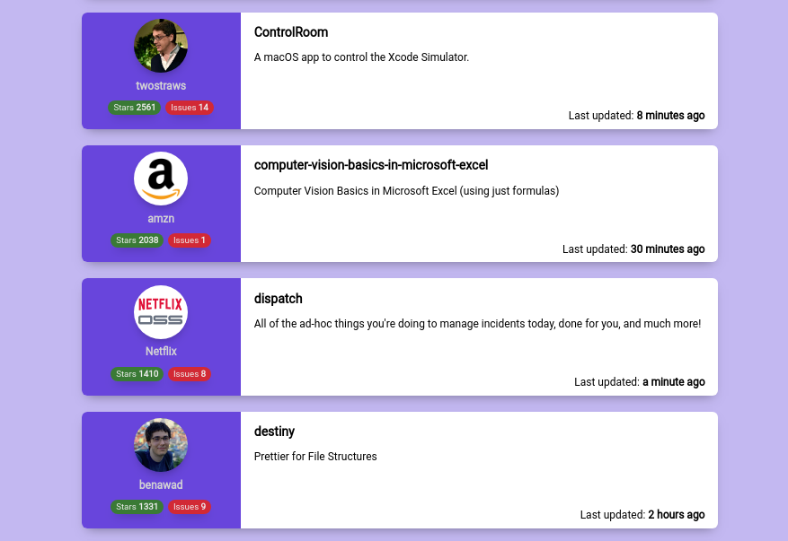

# Github Superstars

Browse the most starred Github repos of the last 30 days. 

**Live preview**: https://halimb.github.io/github-superstars/

## Installation

Simply run

`yarn install` or `npm install`

## Development

For fast preview and live reload, run: 

`yarn serve` or `npm serve`

## Build

In order to build the project run:

`yarn build` or `npm build`

the bundled version will be: `./public/index.html`

## Vendor libraries
* [Vue](https://github.com/vuejs/vue): main UI framework used for the project.
* [Moment.js](https://github.com/moment/moment/): used to manipulate and format dates.
* [axios](https://github.com/axios/axios): used for requesting the Github search API.

## Author

* [**Abdel Halim Bouguedra**](https://www.linkedin.com/in/abdel-halim-bouguedra-72b9a6133/)
